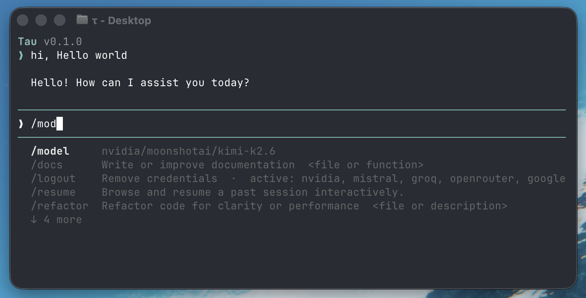

# Tau (τ)

Inspired by [Pi](https://pi.dev), **Tau** brings the same agent framework capabilities to Python developers. A self-extensible agent CLI with a terminal UI, multi-provider LLM support, session management with branching, and a plugin system for tools, commands, and customization.

<p align="center">
  
</p>

Start a conversation with the agent in the terminal.

---

## Quick Start

### Installation

```bash
pip install tau-coding-agent
```

Or install from source:

```bash
git clone https://github.com/Jeomon/Tau.git
cd Tau
pip install -e .
```

### Launch

```bash
tau
```

Authenticate with your LLM provider using `/login` or set environment variables (e.g., `NVIDIA_API_KEY`).

### Common Commands

```bash
tau                                           # Interactive mode
tau --resume                                  # Resume most recent session
tau --model claude-sonnet-4-6                 # Use specific model
tau --print "Summarize this repo"             # One-shot mode
tau -p anthropic --print "Explain this code"  # Print mode with provider
tau --mode rpc                                # RPC mode for IDE extensions
```

> For detailed options, see [CLI Reference](docs/cli-reference.md)

## Features

- **Multi-provider LLM support** — Anthropic Claude, OpenAI GPT, Google Gemini, Mistral AI, Ollama, Azure OpenAI
- **Terminal UI** — Built-in chat interface with syntax highlighting, markdown rendering, and keyboard navigation
- **Rich media support** — Work with text files, images, audio files, and video files via file references or clipboard input
- **Session management** — Persistent sessions with branching, forking, and resuming capabilities
- **Tool execution** — Built-in tools (terminal, file I/O, web fetch) with sandboxed execution and extensibility
- **Plugin system** — Add custom tools, slash commands, hooks, themes, and skills without modifying core code
- **16 built-in themes** — Dark and light themes including dracula, nord, gruvbox, catppuccin, ayu-dark, tokyo-night, rose-pine, and more
- **Context management** — Automatic context compaction and branch summarization for long conversations
- **Python API** — Embed Tau in your own applications programmatically
- **Multiple run modes** — Interactive TUI, print mode (one-shot), JSON event stream, and JSON-RPC for IDE integration

## Documentation

Start here: [**Tau Documentation**](docs/index.md)

**Key resources:**
- [Quickstart](docs/quickstart.md) — Five-minute getting started guide
- [Installation & Setup](docs/installation.md) — Provider authentication and configuration
- [Usage Guide](docs/usage.md) — Interactive mode and slash commands
- [Architecture](docs/architecture.md) — System design and data flow
- [Extensions](docs/extensions.md) — Building tools, commands, and plugins
- [Python API](docs/python-api.md) — Programmatic usage

## Core Architecture

```
Console (CLI) → TUI (Terminal UI) → Runtime (Agent Execution) → Engine (Tools) → Inference (LLM)
```

User input flows through the TUI to the runtime, which executes tools via the engine and calls the LLM provider for inference. Results are rendered back in the TUI and persisted to sessions.

## Configuration

Settings are loaded in order of precedence:
1. Built-in defaults
2. `~/.tau/settings.json` (global user settings)
3. `.tau/settings.json` (project-level settings)
4. Environment variables
5. Command-line flags

Sessions are saved to `~/.tau/sessions/` and can be resumed, forked, or cloned.

### Project Context Files

Tau automatically discovers and includes project-specific instructions from `AGENTS.md` or `CLAUDE.md` in the system prompt. This allows you to:
- Define project rules and coding guidelines for the agent
- Standardize how the agent handles project-specific conventions
- Store project context separately from tool configuration

**Example usage:**
```bash
# Auto-discover AGENTS.md in the project (default behavior)
tau

# Disable project context file loading
tau --no-context-files

# Trust project files explicitly
tau --approve

# Don't trust project files for this run
tau --no-approve
```

See [Project Context Files](docs/project-context.md) for detailed instructions.

## Security & Permissions

Tau executes tools (terminal, file I/O, web operations) with the permissions of the user and process that launched it. There is no built-in permission system for restricting filesystem, process, network, or credential access.

If you need stronger boundaries, consider:
- Running Tau inside a container or sandbox
- Using OS-level security policies
- Configuring environment variables to limit tool access

## Supply Chain Security

We treat dependency changes as reviewed code changes with these practices:

- **Exact version pinning** — All direct dependencies pinned to specific versions in `pyproject.toml`
- **Lockfile integrity** — `uv.lock` is the source of truth; changes require explicit review
- **Dependency auditing** — Use `pip-audit` or `safety` to scan for known vulnerabilities
- **Safe installation** — Install with `--no-deps` to prevent malicious lifecycle scripts

See [SECURITY.md](SECURITY.md) for detailed practices and vulnerability reporting.

## Development

```bash
python -m pytest              # Run tests
pyright tau/                   # Type checking
python -m tau --mode tui       # Launch from source
```

See [Development Setup](docs/development.md) for detailed instructions.

## Contributing

See [CONTRIBUTING.md](CONTRIBUTING.md) for contribution guidelines and [AGENTS.md](AGENTS.md) for project-specific rules.

## License

This project is licensed under the MIT License — see the [LICENSE](LICENSE) file for details.
